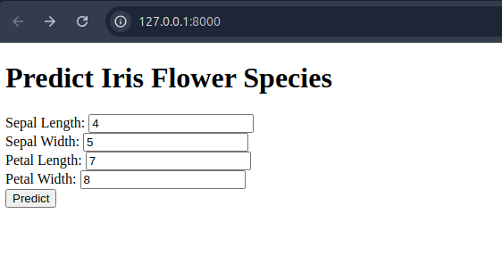
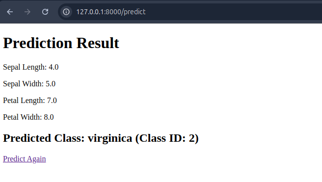

# FastAPI-iris-ml-project
Building a simple FastAPI ML application for Iris dataset. 
Credit: Project from Kingabzpro, great training!

## Usage
```shell
pip install -r requirements.txt
python app.py
```

## Output



